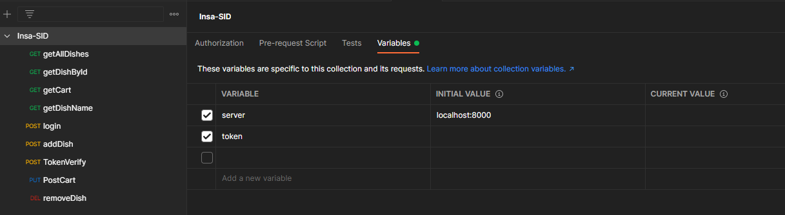
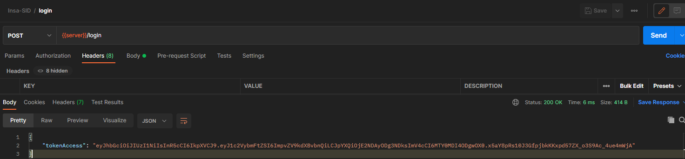

# FISA_3_Delivecrous_AUZOU

## Installation
Installer les paquets de dépendance :
```
npm install -g express
npm install -g body-parser
npm install -g mongoose
npm install -g jsonwebtoken
```

## Routes API
`/dishes` [GET] 
*       affichage de tous les plats
`/dish/:id` [GET]
*       affichage d'un plat par id
`/dish/findByName/:name` [GET]
*       affichage d'un plat par son nom
`/cart/:id` [POST]
*       ajout d'un article au panier
`/cart/:id` [DELETE]
*       suppression d'un article du panier
`/cart` [GET]
*       affichage liste article(s) du panier
`/cart_validation` [PUT]
*       Gérer l'adresse du client et valider sa commande
    - Exemple :
    ```
    {
        "rue" : "test",
        "code_postal": "autre",
        "ville": "Valenciennnes"
    }
    ```
`/*` [GET]
*       Route par défaut


## BD
*    adresse de la base de données par défaut :
    
```
    mongodb://localhost:27017/delivecrous
```     

## Documentation
* Pour l'initialisation du projet (peuplage de la BDD), lancer la commande suivante : `node data_generate/data`
* Visualiser sur MongoDBCompass ou MongoSH si c'est bien peuplé, puis tuer ce processus.
* Lancer le projet principal avec la commande : `node src/delivecrous`.
* Connectez-vous via l'API fournie avec un des noms d'utilisateur : [POST] localhost:8000/login (nous vous conseillons Postman) et récupérez le token.
* Enfin, utilisez directement Postman, avec le fichier de requêtes fourni, pour lancer les requêtes souhaitées.
* Note : vous ne pourrez pas utiliser votre navigateur pour les requêtes GET car le token d'authorisation vous sera demandé.

## Postman
* Lien vers le fichier postman :
```
./postman/Insa-delivecrous_auzou_frémeaux.postman_collection.json
```

* Initialisation du serveur de test (et de son port) et du token sur postman (une seule fois pour toutes les requêtes)
```
Cliquer directement sur le nom de la collection, vous devriez avoir l'onglet "Variables"
```


* S'authentifier via Postman (route `/login`)
```
Configurer la variable d'environnement "token" avec le token renvoyé lors du login
```


